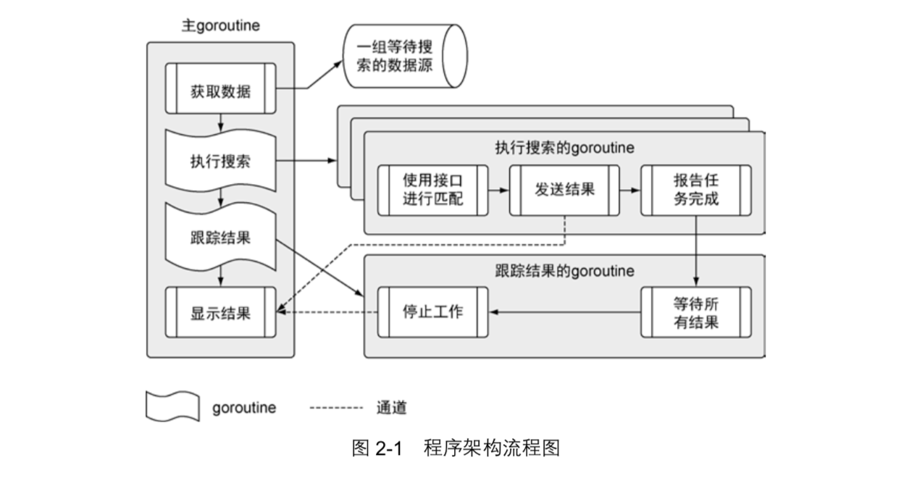

### 第2章

`代码功能`：从不同的数据源拉取数据，将数据内容与一组搜索项做对比，然后将匹配的内容显示在终端窗口。

> 在Go语言中，如果`main`函数返回，整个程序也就终止了。
> Go程序终止时，还会关闭所有之前启动且还在运行的`goroutine`。
> 写并发程序的时候，最佳做法是，在`main`函数返回前，清理并终止所有之前启动的`goroutine`。编写启动和终止时的状态都很清晰的程序，有助于减少bug，放置资源异常。

#### main包

程序的主入口，调用 `main.go` 文件。

- `package`：一个包定义一组编译过的代码，包的名字类似命名空间，可以用来间接访问包内声明的标识符。

- `import`：关键字，导入一段代码，让用户可以访问其中的标识符（如`类型`、`函数`、`常量`、`接口`）。
  > 导入路径前使用“`_`”，是为了让Go语言对包做初始化操作，但是并不使用包里的标识符。
                                                            
- `init`：在main函数执行前调用。

- `main`：执行函数。

***

#### search包

当前程序使用的框架和业务逻辑。由4个不同的代码文件组成，每个文件对应一个独立的职责。
> 当前这个程序都围绕匹配器来运作。这个程序里的匹配器，是指包含特定信息、用于处理某类数据源的实例。

- `标识符`：
  - 大写字母开头标识符，为`公开标识符`，相当于`public`，当代码导入一个包时，可直接访问这个包中任意一个公开标识符
  - 小写字母开头标识符，为`不公开标识符`，相当于`private`，不能被其他包中的代码直接访问

- `变量初始化`：在Go语言中，所有变量都被初始化为其零值。
  > 对于引用类型来说，所引用的底层数据结构会被初始化为对应的零值。但是被声明为其零值的引用类型的变量，会返回nil作为其值。
  - `数值类型`，零值是`0`
  - `字符串类型`，零值是`空字符串`
  - `布尔类型`，零值是`false`
  - `指针`，零值是`nil`

- `变量声明`：
  - `var`：声明变量，初始值为零值。
  - `:=`：简化变量声明运算符，这个运算符用于声明一个变量，同时给这个变量赋予初始值。

- `通道（channel）`、`映射（map）`、`切片（slice）`：是一种实现了一个动态数组的引用类型。

- `for range`：关键字，迭代效果。关键字`range`可以用于迭代数组、字符串、切片、映射和通道。使用for range迭代切片时，每次迭代会返回两个值。第一个值是迭代的元素在切片里的`索引位置`，第二个值是元素值的一个`副本`。*相当于PHP中的foreach效果。*

- `_（下划线）`：可做占位符使用，当调用函数有多个返回值，而又不需要使用其中某个值时，就可以使用`_（下划线）`标识符将其忽略。

- `goroutine`：一个`goroutine`是一个独立于其他函数运行的函数。使用关键字`go`启动一个`goroutine`，然后可以对这个`goroutine`做并发调度。*在第6章会进一步学习goroutine。*

- `闭包`：定义在一个函数内部的函数，内层函数可以直接使用外层函数的变量。

- `defer`：关键字，会安排随后的函数调用在函数返回时才执行。
  > 使用关键字`defer`来调用函数，可以保证这个函数一定会被调用，哪怕函数意外崩溃终止，也能保证关键字`defer`安排调用的函数会被执行。